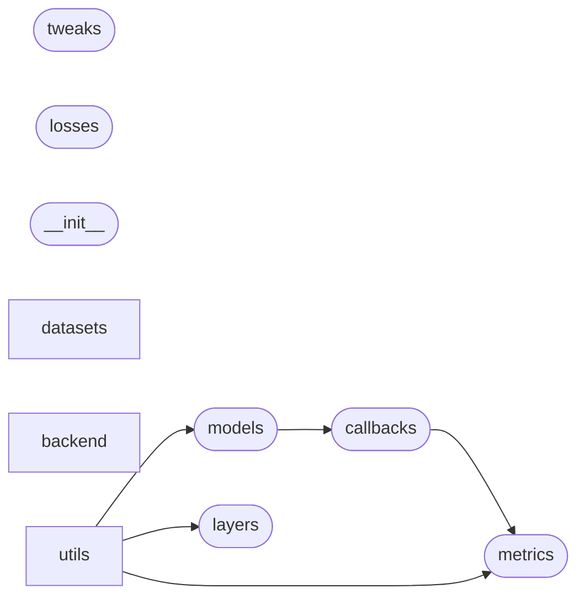

# Code Overview

[_Documentation generated by Documatic_](https://www.documatic.com)

<!---Documatic-section-Codebase Structure Python-start--->
## Codebase Structure Python

The codebase has a single-depth folder structure,
                with 21 code files in total.

<!---Documatic-block-system_architecture-start--->

<!---Documatic-block-system_architecture-end--->

# #
<!---Documatic-section-Codebase Structure Python-end--->

<!---Documatic-section-Important Functions-start--->
## Important Functions

<!---Documatic-block-important_funcs-start--->
<!---Documatic-block-most_used_funcs-start--->
### Most Utilised Functions

* [kgp.metrics.mean_squared_error](3-kgp_metrics.md#kgp.metrics.mean_squared_error) (1 times)
* [kgp.metrics.root_mean_squared_error](3-kgp_metrics.md#kgp.metrics.root_mean_squared_error) (1 times)
<!---Documatic-block-most_used_funcs-end--->
<!---Documatic-block-important_funcs-end--->

# #
<!---Documatic-section-Important Functions-end--->

<!---Documatic-section-File IO-start--->
## File IO

<!---Documatic-block-file_io-start--->
The following files have file read operations

<!---Documatic-block-kgp.datasets-start--->

	
<code>kgp.datasets</code> (Click to Expand!)

* kgp.datasets.gef2012_power

<!---Documatic-block-kgp.datasets-end--->

<!---Documatic-block-kgp.utils-start--->

	
<code>kgp.utils</code> (Click to Expand!)

* kgp.utils.assemble

<!---Documatic-block-kgp.utils-end--->

The following files have file write operations

<!---Documatic-block-kgp.datasets-start--->

	
<code>kgp.datasets</code> (Click to Expand!)

* kgp.datasets.quandl_ustycr

<!---Documatic-block-kgp.datasets-end--->
<!---Documatic-block-file_io-end--->

# #
<!---Documatic-section-File IO-end--->

<!---Documatic-section-Class Hierarchy-start--->
## Class Hierarchy

<!---Documatic-block-Callback-start--->

	
<code>Callback</code> (Click to Expand!)

* kgp.callbacks.Timer
* kgp.callbacks.UpdateGP

<!---Documatic-block-Callback-end--->

<!---Documatic-block-KerasModel-start--->

	
<code>KerasModel</code> (Click to Expand!)

* kgp.models.Model

<!---Documatic-block-KerasModel-end--->

<!---Documatic-block-Layer-start--->

	
<code>Layer</code> (Click to Expand!)

* kgp.layers.GP

<!---Documatic-block-Layer-end--->

<!---Documatic-block-kgp.backend.engines.Engine-start--->

	
<code>kgp.backend.engines.Engine</code> (Click to Expand!)

* kgp.backend.engines.MATLABEngine
* kgp.backend.engines.OctaveEngine

<!---Documatic-block-kgp.backend.engines.Engine-end--->

<!---Documatic-block-object-start--->

	
<code>object</code> (Click to Expand!)

* kgp.backend.engines.Engine
* kgp.backend.gpml.GPML

<!---Documatic-block-object-end--->

# #
<!---Documatic-section-Class Hierarchy-end--->

[_Documentation generated by Documatic_](https://www.documatic.com)