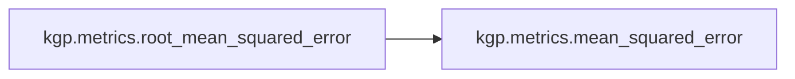

# Kgp Metrics

[_Documentation generated by Documatic_](https://www.documatic.com)

<!---Documatic-section-Codebase Structure-start--->
## Codebase Structure

<!---Documatic-block-system_architecture-start--->
```mermaid
None
```
<!---Documatic-block-system_architecture-end--->

# #
<!---Documatic-section-Codebase Structure-end--->

<!---Documatic-section-kgp.metrics.mean_squared_error-start--->
## [kgp.metrics.mean_squared_error](3-kgp_metrics.md#kgp.metrics.mean_squared_error)

<!---Documatic-section-mean_squared_error-start--->
<!---Documatic-block-kgp.metrics.mean_squared_error-start--->
<details>
	<summary><code>kgp.metrics.mean_squared_error</code> code snippet</summary>

```python
def mean_squared_error(y_true, y_pred):
    return np.mean((np.ravel(y_true) - np.ravel(y_pred)) ** 2)
```
</details>
<!---Documatic-block-kgp.metrics.mean_squared_error-end--->
<!---Documatic-section-mean_squared_error-end--->

# #
<!---Documatic-section-kgp.metrics.mean_squared_error-end--->

<!---Documatic-section-kgp.metrics.root_mean_squared_error-start--->
## [kgp.metrics.root_mean_squared_error](3-kgp_metrics.md#kgp.metrics.root_mean_squared_error)

<!---Documatic-section-root_mean_squared_error-start--->


### Object Calls

* [kgp.metrics.mean_squared_error](3-kgp_metrics.md#kgp.metrics.mean_squared_error)

<!---Documatic-block-kgp.metrics.root_mean_squared_error-start--->
<details>
	<summary><code>kgp.metrics.root_mean_squared_error</code> code snippet</summary>

```python
def root_mean_squared_error(y_true, y_pred):
    return np.sqrt(mean_squared_error(y_true, y_pred))
```
</details>
<!---Documatic-block-kgp.metrics.root_mean_squared_error-end--->
<!---Documatic-section-root_mean_squared_error-end--->

# #
<!---Documatic-section-kgp.metrics.root_mean_squared_error-end--->

[_Documentation generated by Documatic_](https://www.documatic.com)